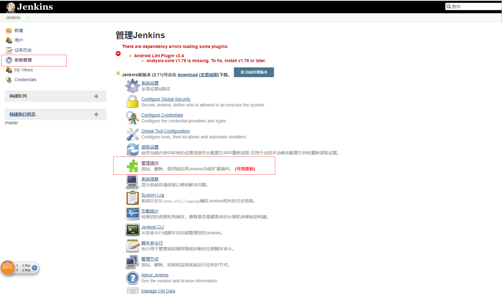
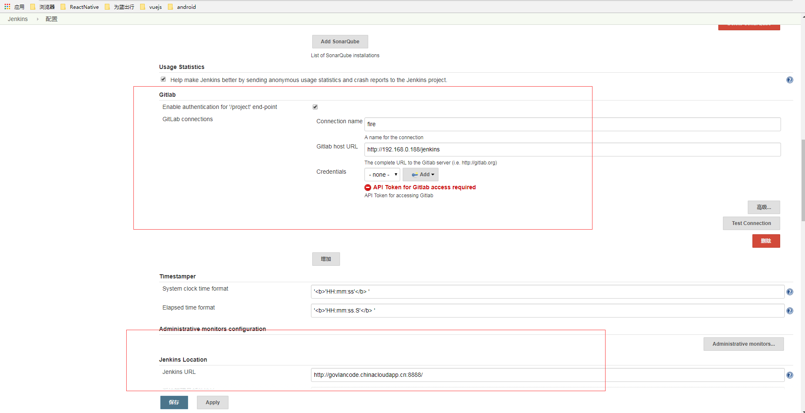
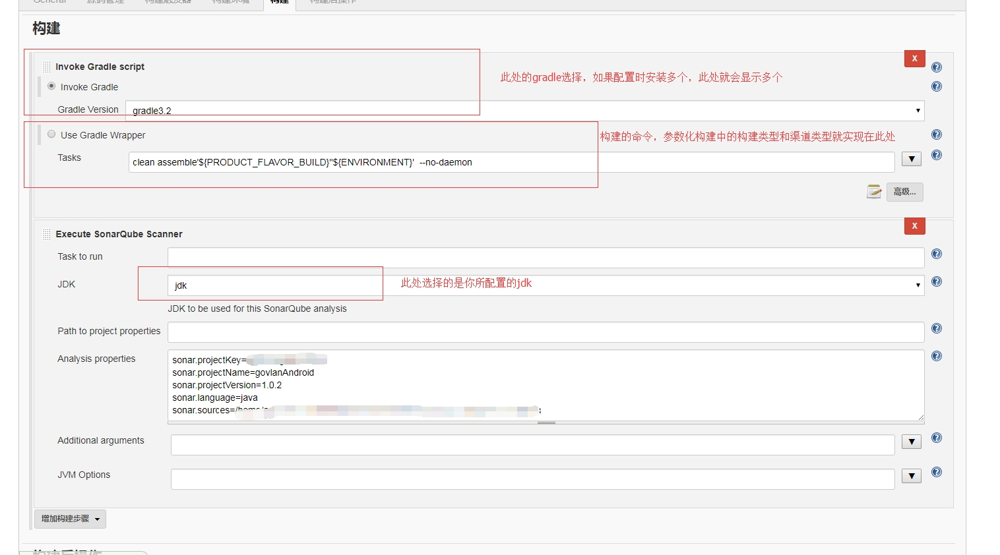

## Jenkins自动打包

本文通过Jenkins+gradle+git实现android自动打包并上传到三方应用托管平台。

### 一、项目结构


   本项目基于AndroidStudio开发的gradle项目，通过git进行版本管理，并且项目代码托管在gitlab上的。项目针
   对最新版本有两个分支：正式服和测试服。服务器通过jenkins自动打包实现每天都能有正式服和测试服的
   最新版本的apk。并通过相关脚本和插件分别将两个版本的apk自动上传到fir.im和蒲公英等项目托管平台
   上，共测试和使用人员去下载使用最新版本的apk。

### 二、实现过程

本地电脑也可以实现jenkins自动打包过程。此处就进行服务器和本地的两个实现过程进行对比：


* 1.jenkins的准备工作

    到[jenkins官网](https://jenkins.io/download/)下载合适的jenkins.war并放置在服务器或者本地合适的位置，打开命令行到放置该文件的路径下通过
    `java -jar jenkins.war`命令运行jenkins.war文件。

    

    本地直接在浏览器上访问`localhost:8080`默认端口是8080,服务器就直接在浏览器上访问服务器ok了

    首次进入的会提示你创建用户并下载相关插件，此处先创建用户，插件先忽略等后面讲解配置是再下载相关插件

    访问成功后的界面：

    

    接下来就进行相关环境的配置了。

* 2.所需相关插件

    插件管理页面就在jenkins页面：系统管理->插件管理->管理插件->可选插件

    

    勾选以下插件：
    ```
    1. Gradle plugin
    2. Git plugin
    3. Android Lint plugin
    4. Git Client plugin
    5. GitLab plugin
    6. fir-plugin
    ```
    (注：fir-plugin需要在fir.im上进行[下载](http://blog.fir.im/jenkins/),fir.im官网上也提供了该插件的使用和安装方法)
    插件下载并安装好后重启jenkins即可。

* 3.相关配置(本地和服务器的配置进行了对比)

    此处配置有两点：系统配置和工具配置

    (1) 系统配置：系统管理->系统配置。系统配置里面有很多可配置的属性,有需要了解的可以去了解一下。

    <table align="center">
       <tr>
           <td></td>
           <td></td>
       </tr>
    </table>

    配置AndroidSDK的所在路径，因为打包的时候会查找本地的AndroidSDK的版本是否匹配，不然打包不成功。

    配置gitLab项目的地址和相关用户

    配置jenkins访问地址(一般不需要更改，如有需要可更改)

    <table align="center">
      <tr>
          <td></td>
          <td></td>
      </tr>
    </table>

    还可以配置邮件提醒(如有需要可配置)

    (2) 工具配置：系统管理->Global Tool Configuration。此处配置有JDK、gradle、git这几个。里面还有其他的工具的配置。如有需要可进行了解。JDK、gradle和git可以通过设置本地的，也可进行自动安装。

    <table align="center">
        <tr>
            <td></td>
            <td></td>
        </tr>
    </table>

    至此，jenkins自动打包的基本配置就ok了。接下来就可以在主页面的面板上去创建自己的项目

* 4.创建项目

    点击新建，输入项目名称并选择项目类型(此处为构建一个自由风格的软件项目)

    

    在面板上点击新建的项目，对新建的项目进行配置

    

    实行参数化构建，针对打包环境的区别和多渠道打包的区别实现参数化构建。构建时就可通过自己的选择环境和渠道进行打包

    

    对项目里面源码要进行管理，前面下载了git的插件和对git进行的配置在此处是需要用到的，此处需要添加代码仓库的地址，填写用户名和密码，分支的选择

    

    此处就要进行构建触发器的操作，填写构建时间和检查时间。当然这里你也可以写脚本和代码仓库的Hook进行关联实现提交代码就自动构建

    

    此处进行项目的构建操作，需要选择gradle的版本，填写构建命令。选择配置的jdk

    

    构建后的操作就是将打包好的apk上传到fir.im和蒲公英应用托管平台了

    fir.im的配置在上面描写的[下载地址](http://blog.fir.im/jenkins/)里已经很好的说明了使用方法。点击增加构建后操作步骤 -> 选择upload to fir.im选项,此时获取自己在fir.im平台上的Token填写到fir.im Token 的填写框中，并检查你的token是否正确

    

    蒲公英上传和fir.im上传是有区别的 ，蒲公英通过jenkins上传也是有[教程](https://www.pgyer.com/doc/view/jenkins)的,就是在构建那一步里增加额外的脚本命令即可

    curl -F "file=@app/build/outputs/apk/app-baidu-release.apk" -F "uKey=11111" -F "_api_key=11111" https://qiniu-storage.pgyer.com/apiv1/app/upload

    更改apk的路径为当前生成的apk的路径（此处路径可以使用参数化构建来实现多渠道的一一对应），替换蒲公英平台上的userKey和APIKey即可

    

    各种配置完全并保存后就可以进行项目的构建了，在相应的项目页面点击左边栏目的Build with Parameters 选择相应的构建环境和渠道环境进行构建

    在构建历史列表里面点击当前正在进行的构建进行查看构建的输出信息

    <table align="center">
       <tr>
           <td></td>
           <td></td>
       </tr>
    </table>

    构建完成后会有构建成功，上传到应用托管平台成功的信息日志

    <table align="center">
       <tr>
           <td></td>
           <td></td>
       </tr>
    </table>

### 三、注意事项


   * 1.AndroidSDK的compileSdkVersion和buildToolsVersion要保证有相应的版本，不然构建不通过

   * 2.相应版本的Gradle要保证本地存在，不然构建也是不通过的


